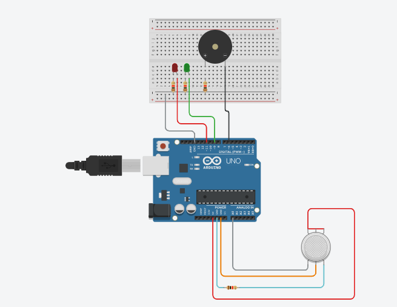

# 🔥 Arduino Gas Leak Detector System

This project demonstrates a gas leak detection system using an MQ gas sensor and Arduino Uno. The system continuously monitors the presence of combustible gases and triggers alerts via a buzzer and LED if dangerous levels are detected.

---

##  🛠️ Components Used

- Arduino Uno
- MQ-2 Gas Sensor
- LED
- Buzzer
- Resistor (220Ω)
- Breadboard
- Jumper Wires
- USB Cable for power and serial communication

---

##  ⚙️ How It Works

The MQ-2 sensor measures the concentration of gases like LPG, propane, and methane. The sensor provides an analog signal that the Arduino reads using `analogRead()`.

###  Workflow:

1. The sensor outputs a voltage proportional to gas concentration.
2. The Arduino checks whether this analog value exceeds a set threshold (e.g., 400).
3. If the gas level is too high:
   - A **buzzer** sounds an alert.
   - An **LED** lights up as a visual warning.
4. The gas level is also printed on the **Serial Monitor** for observation.

---

##  📷 Circuit Diagram



*The sensor’s analog pin connects to A0, LED to pin 7, and buzzer to pin 8.*

---

##  💻 Full Arduino Code

```cpp
int gasSensor = A0;     // MQ-2 sensor connected to analog pin A0
int buzzer = 8;         // Buzzer connected to digital pin 8
int led = 7;            // LED connected to digital pin 7

void setup() {
  pinMode(buzzer, OUTPUT);
  pinMode(led, OUTPUT);
  Serial.begin(9600);   // Start serial monitor at 9600 baud
}

void loop() {
  int gasLevel = analogRead(gasSensor); // Read sensor value
  Serial.println(gasLevel);             // Output to Serial Monitor

  if (gasLevel > 400) {
    digitalWrite(buzzer, HIGH);         // Sound buzzer
    digitalWrite(led, HIGH);            // Turn on LED
  } else {
    digitalWrite(buzzer, LOW);          // Turn off buzzer
    digitalWrite(led, LOW);             // Turn off LED
  }

  delay(500); // Wait for 0.5 seconds before reading again
}
